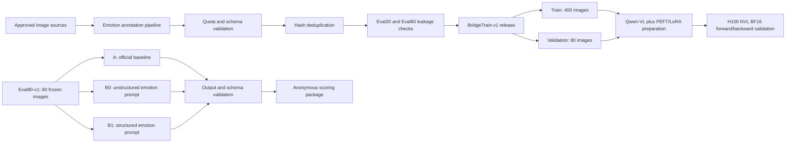

# Architecture and experiment flow

## End-to-end view

## Evaluation contract

Eval80-v1 was treated as a frozen contract rather than an informal image folder:

1. Validate image identities, labels, category quotas, and hashes.
2. Pin the model snapshot, prompt version, generation parameters, and random seed.
3. Run one condition through the same CLI entry point.
4. Validate exactly 80 structurally complete outputs.
5. Preserve configuration, logs, outputs, and acceptance evidence together.
6. Randomise conditions before human scoring to reduce evaluator bias.

## LoRA readiness boundary

The pipeline reached all of the following:

- deterministic training and validation data release;
- PEFT LoRA injection;
- visual-tower freezing;
- targeted-module and trainable-parameter validation;
- real-image BF16 forward and backward execution;
- non-zero-gradient verification.

It did **not** reach optimiser updates, a completed training run, or a saved adapter checkpoint. This boundary is stated explicitly so the portfolio remains technically accurate.

